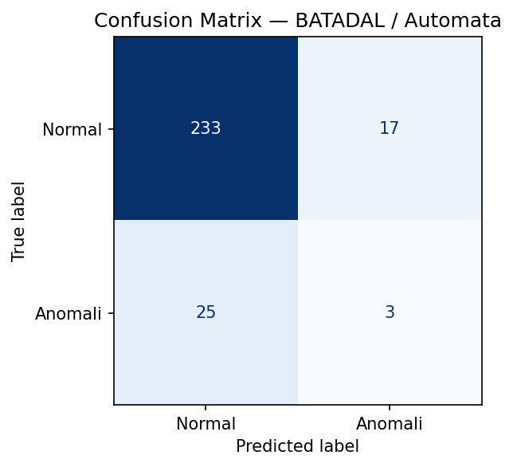
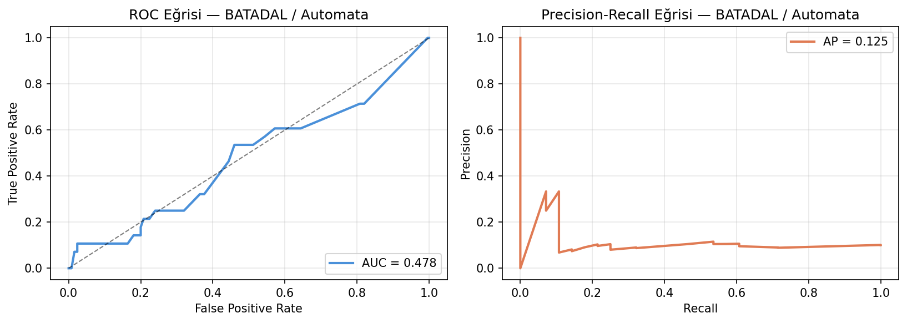
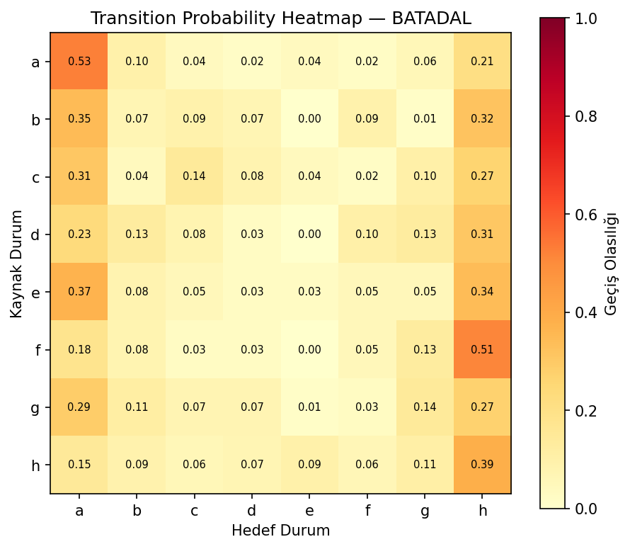
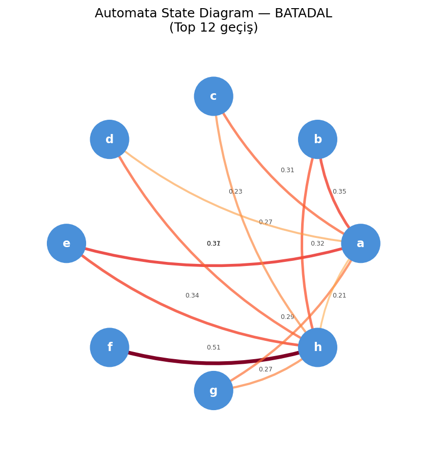
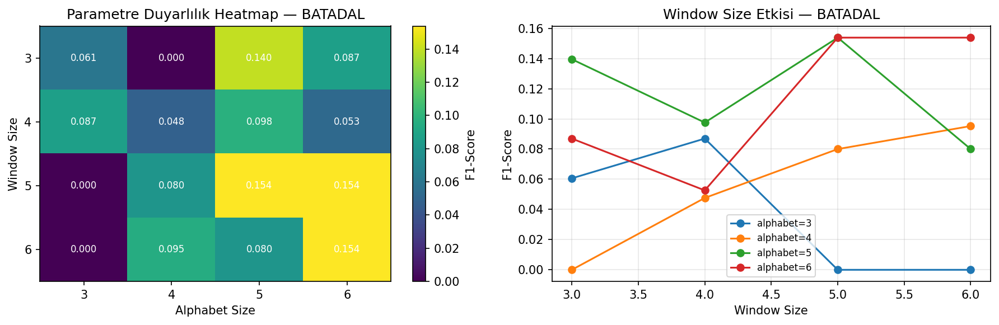
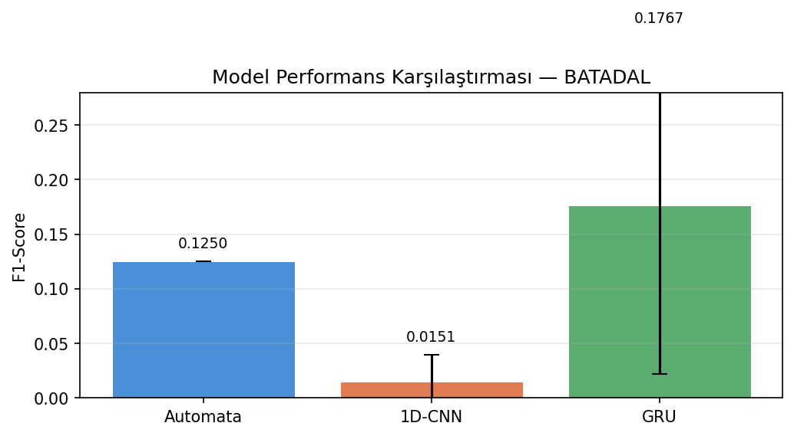
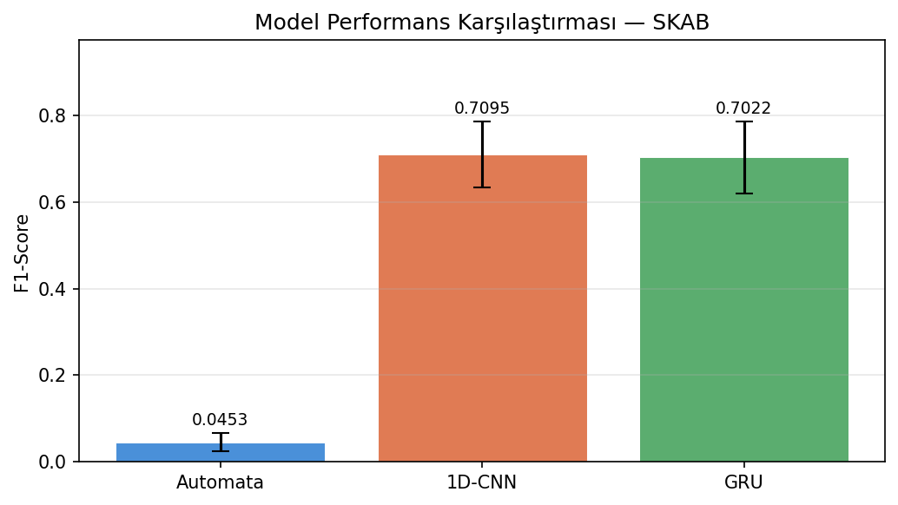

# From Black-Box to Explainability: Probabilistic Automata for Time Series Analysis

> Yazılım Geliştirme Dersi — 2. Proje  
> Kocaeli Üniversitesi, Bilişim Sistemleri Mühendisliği  

---

## İçindekiler

1. [Proje Özeti](#1-proje-özeti)  
2. [Veri Setleri](#2-veri-setleri)  
3. [Kurulum ve Çalıştırma](#3-kurulum-ve-çalıştırma)  
4. [Proje Mimarisi](#4-proje-mimarisi)  
5. [Modelleme Yaklaşımları](#5-modelleme-yaklaşımları)  
6. [Deneysel Sonuçlar](#6-deneysel-sonuçlar)  
7. [Olasılıksal Açıklanabilirlik Modülü](#7-olasılıksal-açıklanabilirlik-modülü)  
8. [Görselleştirmeler](#8-görselleştirmeler)  
9. [İstatistiksel Analiz](#9-istatistiksel-analiz)  
10. [Sonuç ve Tartışma](#10-sonuç-ve-tartışma)  

---

## 1. Proje Özeti

Bu proje, zaman serisi anomali tespiti probleminde iki farklı modelleme paradigmasını karşılaştırmaktadır:

- **Derin Öğrenme (Black-Box):** 1D-CNN ve GRU modelleri
- **Olasılıksal Otomata (Explainable):** PAA → SAX → Geçiş Matrisi tabanlı model

Karşılaştırma yalnızca performans metrikleriyle sınırlı kalmayıp; **genellenebilirlik**, **gürültüye dayanıklılık** ve **açıklanabilirlik** boyutlarını da kapsamaktadır.

---

## 2. Veri Setleri

### BATADAL (Building Anomaly Test Data for Automated Learning)
| Özellik | Değer |
|---|---|
| Kullanılan dosya | `BATADAL_dataset04.csv` (Training Dataset 2) |
| Hedef değişken | `ATT_FLAG` |
| Zaman sütunu | `DATETIME` (model girdisi dışı) |
| Veri bölme | %60 train / %20 val / %20 test (zaman sıralı) |
| Anomali oranı | %4.07 (102 anomali / 2506 train örneği) |
| Sınıf dengesi | 23.6:1 (Normal:Anomali) |

### SKAB (Skoltech Anomaly Benchmark)
| Özellik | Değer |
|---|---|
| Kullanılan klasörler | `valve1`, `valve2` |
| Hedef değişken | `anomaly` |
| Dışlanan sütunlar | `datetime`, `changepoint`, `source_group`, `source_file` |
| Veri bölme | GroupKFold (n=5), grup değişkeni: `source_file` |
| Anomali oranı | %34.17 |
| Sınıf dengesi | 1.9:1 (Normal:Anomali) |

---

## 3. Kurulum ve Çalıştırma

```bash
# Repo'yu klonla
git clone https://github.com/<kullanici>/time-series-anomaly-benchmark.git
cd time-series-anomaly-benchmark

# Sanal ortam oluştur
python -m venv venv
source venv/bin/activate  # Windows: venv\Scripts\activate

# Bağımlılıkları kur
pip install -r requirements.txt

# Veri setlerini yerleştir
# data/BATADAL/BATADAL_dataset04.csv
# data/SKAB/valve1/*.csv
# data/SKAB/valve2/*.csv

# Projeyi çalıştır
python src/main.py

# Birim testleri çalıştır
python -m pytest src/test_automata.py -v
```

### Çıktılar
- Konsol: Tüm bölüm sonuçları, JSON açıklanabilirlik raporları, istatistiksel test sonuçları
- `outputs/figures/`: Tüm görselleştirmeler (PNG)

---

## 4. Proje Mimarisi

```
time-series-anomaly-benchmark/
├── src/
│   ├── main.py           # Ana pipeline — tüm bölümleri çağırır
│   ├── data_loader.py    # BATADAL ve SKAB veri yükleme
│   ├── preprocessing.py  # Normalizasyon, PCA, veri bölme
│   ├── automata.py       # PAA, SAX, geçiş matrisi, Levenshtein
│   ├── deep_learning.py  # 1D-CNN ve GRU modelleri
│   ├── pipeline.py       # Deney pipeline'ları
│   ├── visualize.py      # Görselleştirme modülü
│   ├── test_automata.py  # 22 birim test
│   └── config.json       # Merkezi konfigürasyon
├── data/
│   ├── BATADAL/
│   └── SKAB/
├── outputs/
│   └── figures/          # Üretilen görseller
├── requirements.txt
└── .gitignore
```

### Yazılım Tasarım İlkeleri

- **Merkezi Konfigürasyon:** Tüm parametreler `config.json`'da tutulmaktadır. Hard-coded değer kullanılmamaktadır.
- **Modüler Pipeline:** Her işlem adımı bağımsız bir modülde tanımlanmıştır.
- **Veri Sızıntısı Önleme:** Normalizasyon, PCA ve SAX sözlüğü yalnızca train verisi üzerinden fit edilmektedir.

---

## 5. Modelleme Yaklaşımları

### 5.1 Otomata Tabanlı Model

```
Ham Zaman Serisi
      ↓
  PCA (n=1)          # Çok boyutlu veri → tek boyut
      ↓
  PAA                # Piecewise Aggregate Approximation
      ↓              # window_size pencerelerinde ortalama
  SAX                # Symbolic Aggregate approXimation
      ↓              # Sürekli → sembolik dizi (alphabet_size harf)
Geçiş Matrisi        # P(Si → Sj) = geçiş_sayısı / toplam_çıkış
      ↓
Anomali Skoru        # score = -log(P(Si → Sj))
      ↓
Karar (95. persentil eşiği)
```

**Unseen Pattern Yönetimi:** Test sırasında eğitimde görülmemiş pattern ile karşılaşıldığında Levenshtein (Edit Distance) algoritması ile en yakın eğitim pattern'ı bulunur ve sistem o state üzerinden devam eder.

### 5.2 Derin Öğrenme Modelleri

**1D-CNN Mimarisi:**
```
Conv1D(in=features, out=16, kernel=3, padding=1)
→ ReLU → MaxPool1d(2)
→ Flatten
→ Linear(16*(seq_len//2), hidden_size)
→ ReLU → Linear(hidden_size, 1)
```

**GRU Mimarisi:**
```
GRU(input=features, hidden=hidden_size, layers=num_layers)
→ Dropout(0.1)
→ Linear(hidden_size, 1)
```

**Ortak Eğitim Parametreleri:**

| Parametre | Değer |
|---|---|
| Epoch üst sınırı | 50 |
| Batch size | 32 |
| Learning rate | 0.001 |
| Early stopping patience | 5 |
| Random seeds | [42, 123, 2026, 7, 999] |
| Loss | BCEWithLogitsLoss (pos_weight=otomatik) |
| Optimizer | Adam |

---

## 6. Deneysel Sonuçlar

### 6.1 BATADAL — Temel Performans

| Model | F1-Score | Precision | Recall | F1 Std |
|---|---|---|---|---|
| Automata | 0.1250 | 0.1500 | 0.1071 | — |
| 1D-CNN | 0.0151 | 0.0244 | — | ±0.0244 |
| GRU | 0.1767 | — | — | ±0.1544 |

> **Not:** BATADAL'da aşırı sınıf dengesizliği (%4 anomali) tüm modellerin F1 skorunu olumsuz etkilemektedir. 23.6:1 oranındaki dengesizlik, özellikle CNN'in düşük F1'ini açıklamaktadır.

### 6.2 SKAB — GroupKFold Sonuçları (5 Fold)

| Model | Fold 1 | Fold 2 | Fold 3 | Fold 4 | Fold 5 | Ort. F1 | Std |
|---|---|---|---|---|---|---|---|
| Automata | 0.0508 | 0.0516 | 0.0564 | 0.0036 | 0.0639 | 0.0453 | ±0.0214 |
| 1D-CNN | 0.5973 | 0.7430 | 0.6411 | 0.7820 | 0.7842 | 0.7095 | ±0.0765 |
| GRU | 0.5778 | 0.6912 | 0.6555 | 0.7991 | 0.7875 | 0.7022 | ±0.0830 |

### 6.3 Gürültü Deneyi (BATADAL)

| Senaryo | Otomata F1 |
|---|---|
| Orijinal veri | 0.1250 |
| Gaussian noise (σ=0.1) | 0.1200 |
| F1 düşüşü | %4.0 |

> Otomata modeli Gaussian gürültüye karşı düşük duyarlılık göstermiştir. Bu, sembolik SAX dönüşümünün küçük varyasyonları filtreleme özelliğinden kaynaklanmaktadır.

### 6.4 Parametre Duyarlılık Analizi (BATADAL)

| Window Size \ Alphabet Size | 3 | 4 | 5 | 6 |
|---|---|---|---|---|
| 3 | 0.061 | 0.000 | 0.140 | 0.087 |
| 4 | 0.087 | 0.048 | 0.098 | 0.053 |
| 5 | 0.000 | 0.080 | **0.154** | **0.154** |
| 6 | 0.000 | 0.095 | 0.080 | **0.154** |

**En iyi parametreler:** Window Size = 5, Alphabet Size = 5, F1 = 0.154

> Küçük alphabet boyutu (3) bazı window kombinasyonlarında F1=0.000'a düşmektedir. Bu, sembolik çözünürlüğün yetersiz kalması durumunda otomatanın anlamsız geçiş dağılımları öğrendiğini göstermektedir.

---

## 7. Olasılıksal Açıklanabilirlik Modülü

Her anomali kararı için sistem aşağıdaki JSON formatında deterministik ve yeniden üretilebilir bir açıklama üretmektedir:

```json
{
    "time_step": 11,
    "state": "h",
    "pattern": "dae",
    "status": "unseen",
    "mapped_to": "dag",
    "levenshtein_distance": 1,
    "transitions": [
        {"from": "d", "to": "a", "probability": 0.230769},
        {"from": "a", "to": "e", "probability": 0.037037}
    ],
    "path_probability": 0.0085470083,
    "decision": "anomaly",
    "confidence": 51.52
}
```

### Alan Açıklamaları

| Alan | Açıklama |
|---|---|
| `state` | Mevcut SAX durumu |
| `pattern` | Gözlemlenen SAX örüntüsü |
| `status` | `seen` / `unseen` — eğitimde görülüp görülmediği |
| `mapped_to` | Unseen durumunda Levenshtein ile eşleşen en yakın pattern |
| `levenshtein_distance` | Edit distance uzaklığı |
| `transitions` | Her adımın geçiş olasılığı: P(Si → Sj) |
| `path_probability` | ∏ P(Si → Si+1) — dizinin toplam olasılığı |
| `decision` | Model kararı: `anomaly` / `normal` |
| `confidence` | [50, 99.99] aralığında güven skoru |

### Güven Skoru Hesabı

```
score >= threshold → confidence = 50 + ((score - threshold) / threshold) × 50
score <  threshold → confidence = 50 + ((threshold - score) / threshold) × 50
```

### Yorumlama

- **Düşük path_probability** → Beklenmeyen durum geçişleri → **Anomali**
- **Yüksek path_probability** → Normal davranışla uyumlu → **Normal**
- **Unseen pattern** → Levenshtein ile en yakın bilinen duruma eşlenir

---

## 8. Görselleştirmeler

### Confusion Matrix (BATADAL / Automata)


### ROC ve Precision-Recall Eğrisi (BATADAL / Automata)


### Transition Probability Heatmap (BATADAL)


> `f → h` geçişi 0.51 ile en baskın geçiştir. `a` durumunun öz-döngüsü (0.53) normalin büyük kısmının bu durumda geçirdiğini göstermektedir.

### Automata State Diagram (BATADAL)


### Parametre Duyarlılık Grafikleri


### Model Karşılaştırması



---

## 9. İstatistiksel Analiz

### Wilcoxon Signed-Rank Testi

#### BATADAL — CNN vs GRU (5 Seed)

| Model | Seed F1'leri | Ortalama |
|---|---|---|
| 1D-CNN | [0.0, 0.0629, 0.0, 0.0, 0.0124] | 0.0151 |
| GRU | [0.0, 0.2797, 0.3878, 0.2158, 0.0] | 0.1767 |

**Sonuç:** Statistic = 1.0, p-value = 0.1441  
→ p ≥ 0.05: BATADAL'da CNN ve GRU arasındaki fark **istatistiksel olarak anlamsız** (küçük örneklem ve yüksek varyans).

#### SKAB — CNN vs GRU (Fold Bazlı)

**Sonuç:** Statistic = 6.0, p-value = 0.8125  
→ p ≥ 0.05: SKAB'da CNN ve GRU performansları **birbirine benzer**.

#### SKAB — CNN vs Automata (Fold Bazlı)

**Sonuç:** Statistic = 0.0, p-value = 0.0625  
→ p = 0.0625 ≈ 0.05 sınırında: DL ve Automata arasındaki fark **yakın-anlamlı** (n=5 fold ile sınırlı istatistiksel güç).

> **Not:** 5 fold ile Wilcoxon testinin istatistiksel gücü düşüktür. SKAB için daha fazla fold veya bootstrap yöntemleri daha güvenilir sonuç verebilir.

---

## 10. Sonuç ve Tartışma

### Temel Bulgular

**1. Veri Dengesizliğinin Etkisi**  
BATADAL'da %4 anomali oranı (23.6:1) tüm modellerin F1 skorunu ciddi biçimde düşürmektedir. SKAB'da daha dengeli dağılım (%34) sayesinde DL modelleri 0.70+ F1 elde etmektedir. Bu bulgu, sınıf dengesizliğinin model performansı üzerindeki etkisini açıkça ortaya koymaktadır.

**2. DL vs Otomata — Performans/Açıklanabilirlik Dengesi**  
SKAB'da CNN (0.710) ve GRU (0.702) otomataya (0.045) kıyasla çok üstün F1 skorları elde etmiştir. Ancak otomata her karar için deterministik, matematiksel olarak gerekçelendirilmiş açıklamalar üretmektedir. DL modelleri bu açıklanabilirliği sunamamaktadır.

**3. Gürültüye Dayanıklılık**  
Otomata Gaussian gürültü karşısında yalnızca %4 F1 kaybı yaşamıştır (0.125 → 0.120). SAX dönüşümünün ayrıklaştırma özelliği küçük sayısal pertürbasyonları filtrelemekte ve bu durum otomatayı gürültüye doğal olarak dayanıklı kılmaktadır.

**4. Parametre Etkisi**  
Küçük alphabet boyutu (3) modelin yeterli sembolik çözünürlüğe sahip olmamasına yol açmaktadır. Optimum nokta window=5, alphabet=5 olarak belirlenmiştir.

**5. Unseen Pattern Yönetimi**  
Test setindeki anomali bölgelerinde unseen pattern oranı yüksektir; bu pattern'lar Levenshtein ile en yakın eğitim pattern'ına eşlenmekte ve sistem kesintisiz çalışmaya devam etmektedir.

### Karşılaştırmalı Değerlendirme

| Kriter | 1D-CNN | GRU | Otomata |
|---|---|---|---|
| BATADAL F1 | 0.015 | 0.177 | 0.125 |
| SKAB F1 | 0.710 | 0.702 | 0.045 |
| Gürültü Dayanıklılığı | Bilinmiyor | Bilinmiyor | Yüksek (%4 kayıp) |
| Açıklanabilirlik | ✗ | ✗ | ✓ (JSON + path prob) |
| Eğitim Süresi | Orta | Orta | Çok Hızlı |
| Parametre Hassasiyeti | Düşük | Düşük | Yüksek |

### Sonuç

Proje, iki farklı modelleme paradigmasının farklı veri koşulları altında farklı davranışlar sergilediğini ortaya koymaktadır. Dengeli veri setlerinde DL modelleri açık ara üstündür. Ancak açıklanabilirlik, gürültüye dayanıklılık ve gerçek zamanlı karar gerekçelendirmesinin kritik olduğu senaryolarda olasılıksal otomata yaklaşımı önemli avantajlar sunmaktadır. Hibrit yaklaşımlar (DL tahmin + otomata açıklama) gelecekteki araştırmalar için umut vadedici bir yön olarak değerlendirilebilir.

---

## Birim Testler

```bash
python -m pytest src/test_automata.py -v
```

**22/22 test başarılı:**
- `TestLevenshteinDistance` — 9 test (boş string, simetri, SAX pattern'ları)
- `TestUnseenPatterns` — 6 test (seen/unseen tespiti, boş eğitim, kısa sequence)
- `TestTransitionMatrix` — 3 test (satır toplamları, smoothing, baskın geçiş)
- `TestTransitionsAndPathProb` — 4 test (geçiş sayısı, çarpım doğruluğu)

---

## Referanslar

- Lin, J., Keogh, E., Wei, L., & Lonardi, S. (2007). Experiencing SAX: a novel symbolic representation of time series. *Data Mining and Knowledge Discovery*, 15(2), 107–144.
- Taormina, R., et al. (2018). The Battle Of The Attack Detection Algorithms: Disclosing Cyber Attacks On Water Distribution Networks. *Journal of Water Resources Planning and Management*.
- Filonov, P., Lavrentyev, A., & Vorontsov, A. (2016). SKAB — Skoltech Anomaly Benchmark. Skolkovo Institute of Science and Technology.
- Hochreiter, S., & Schmidhuber, J. (1997). Long Short-Term Memory. *Neural Computation*, 9(8), 1735–1780.